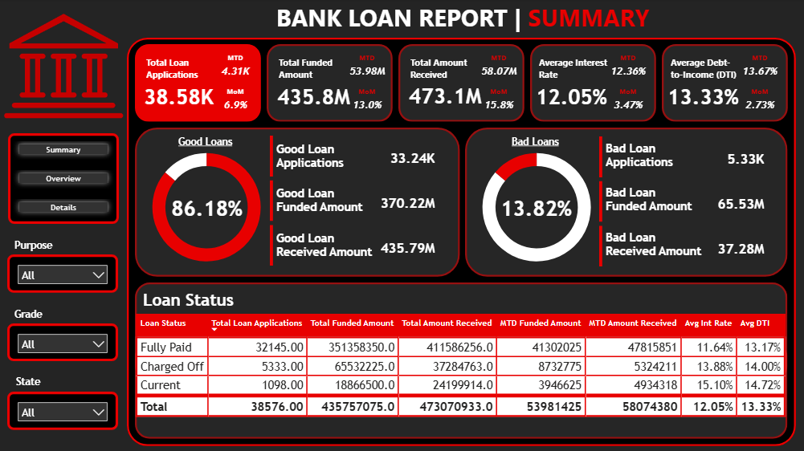
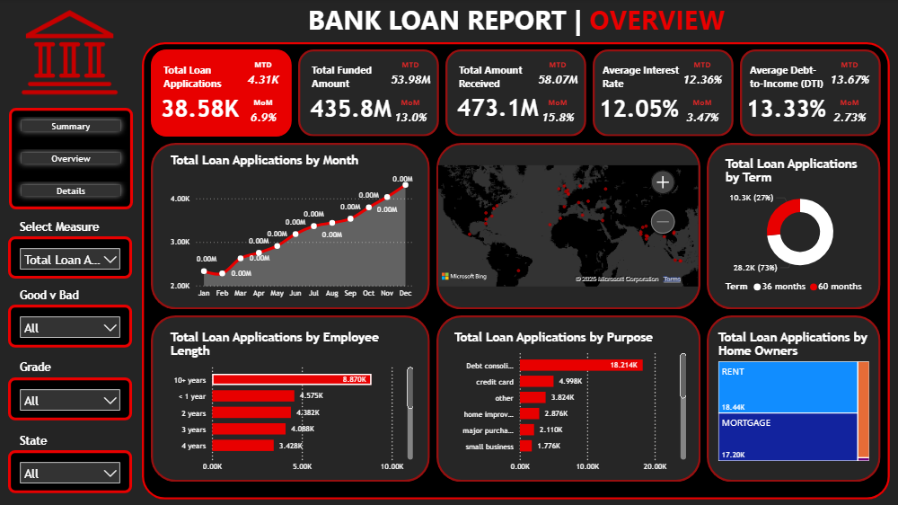

# Bank Loan Analysis Report

[](https://www.python.org/)
[](Loan%20Analysis%20Dashboard.pbix)
[](requirements.txt)
[](main.ipynb)

## Project Overview

This project presents a comprehensive analysis of a bank's loan portfolio using a dataset of over 38,000 loan records. The primary goal is to monitor lending activities, assess portfolio health, and identify key trends to inform data-driven lending strategies.

The analysis is delivered through two primary channels:
1.  A **Python-based Exploratory Data Analysis (EDA)** in a Jupyter Notebook, which calculates key performance indicators (KPIs) and generates detailed visualizations.
2.  An interactive **Power BI Dashboard** that provides a high-level, visual summary of the most critical metrics for business stakeholders.

---

## Table of Contents
- [Business Problem](#business-problem)
- [Key Performance Indicators (KPIs)](#key-performance-indicators-kpis)
- [Dataset](#dataset)
- [Tools Used](#tools-used)
- [Project Structure](#project-structure)
- [Setup and Installation](#setup-and-installation)
- [Dashboard Snapshots](#dashboard-snapshots)
- [Conclusion](#conclusion)

## Business Problem
To effectively manage our lending operations, we need a robust reporting system that provides clear insights into our loan portfolio. This report aims to answer critical business questions, such as:
- What is the overall volume and value of our lending activities?
- How are our key metrics (applications, funding, repayments) trending on a month-over-month basis?
- What is the quality of our loan portfolio (Good Loans vs. Bad Loans)?
- What are the primary drivers for loan applications (e.g., purpose, state, borrower's employment history)?

## Key Performance Indicators (KPIs)
The analysis focuses on several core metrics, categorized into two main dashboards:

**1. Summary Dashboard:**
- **Total Loan Applications:** Overall count, Month-to-Date (MTD), and Month-over-Month (MoM) growth.
- **Total Funded Amount:** Total value of loans disbursed, with MTD and MoM comparisons.
- **Total Amount Received:** Total value of payments received from borrowers.
- **Good Loan vs. Bad Loan Analysis:** A breakdown of applications, funded amounts, and received amounts for 'Fully Paid'/'Current' loans vs. 'Charged Off' loans.
- **Loan Status Grid:** A summary table of key metrics grouped by the current loan status.

**2. Overview Dashboard:**
- **Monthly Trends:** Line charts showing applications, funding, and repayments over time.
- **Regional Analysis:** Filled map and bar charts visualizing lending activity by state.
- **Loan Characteristics:** Donut and bar charts analyzing loan distribution by Term, Employee Length, Purpose, and Home Ownership status.

## Dataset
The dataset used is `financial_loan_data_excel.xlsx`, containing 38,576 records and 24 columns of loan and borrower information, including:
- Borrower demographics (`address_state`, `emp_length`, `home_ownership`)
- Loan details (`loan_amount`, `int_rate`, `purpose`, `term`, `grade`)
- Performance metrics (`loan_status`, `total_payment`, `issue_date`)
- Financial health indicators (`dti`, `annual_income`)

## Tools Used
- **Python:** For data cleaning, manipulation, and analysis.
  - **Pandas:** Core library for data handling.
  - **Matplotlib & Plotly:** For generating static and interactive visualizations.
  - **Jupyter Notebook:** As the interactive development environment.
- **Power BI:** For creating the final interactive business intelligence dashboard.
- **Excel:** As the data source and for potential ad-hoc analysis.

## Project Structure

├── Data/

│ └── financial_loan_data_excel.csv

├── Documents/

│ └── ... (Supporting .docx files)

├── images/

│ └── ... (Saved visualizations)

├── venv/

├── Loan Analysis Dashboard - Excel.xlsx

├── Loan Analysis Dashboard.pbix

├── main.ipynb

├── README.md

└── requirements.txt


## Setup and Installation
To run the Python analysis notebook, follow these steps:

1.  **Clone the repository:**
    ```bash
    git clone <your-repo-link>
    cd <your-repo-folder>
    ```

2.  **Create and activate a virtual environment:**
    ```bash
    # Create the venv
    python -m venv venv

    # Activate on Windows
    venv\Scripts\activate
    # Activate on macOS/Linux
    source venv/bin/activate
    ```

3.  **Install the required packages:**
    ```bash
    pip install -r requirements.txt
    ```

4.  **Launch Jupyter Notebook:**
    ```bash
    jupyter notebook
    ```
    Navigate to and open `main.ipynb` to view and run the analysis.

## Dashboard Snapshots

**Summary Dashboard**


**Overview Dashboard**


## Conclusion

This project provides a 360-degree view of the bank's loan portfolio. The Python notebook offers a granular, reproducible analysis of the data, while the Power BI dashboard delivers actionable, high-level insights to stakeholders, enabling better risk assessment and strategic planning.
